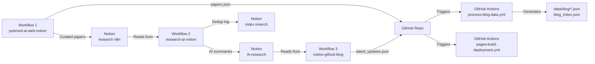
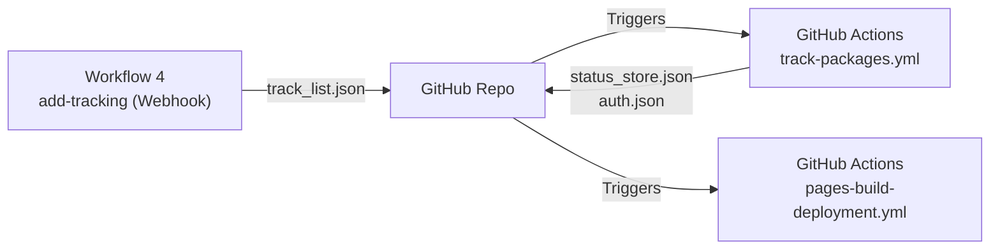
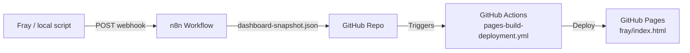

# ARCHITECTURE.md — NTWKKM Personal Website

**Last Updated:** 2026-05-21

## Overview

Static personal website hosted on GitHub Pages (`ntwkkm.github.io`). Serves as a professional portfolio for an Emergency Medicine physician & Clinical Informatics developer.

## Pages & Core Files

| File | Purpose |
| --- | --- |
| `index.html` | Homepage — paper slider + project portfolio grid |
| `blog.html` | Research blog reader — sidebar list + article detail view |
| `tracking/index.html` | Package tracking dashboard — Thailand Post status viewer |
| `fray/index.html` | Fray Dashboard (HTML Structure) |
| `fray/fray-dashboard.css` | Fray Dashboard Styles (extracted for performance) |
| `fray/fray-dashboard.js` | Fray Dashboard Rendering Logic (isolated from HTML) |
| `fray/dashboard-snapshot.json` | Observability snapshot from Fray (updated via n8n, consumed directly by frontend) |
| `pl/index.html` | `[NEW]` NTWKKM Knowledge Vault — Auto-synced from private `NTWKKM/pl` |
| `manifest.json` | `[NEW]` PWA manifest — installable web app experience |
| `sw.js` | `[NEW]` Service Worker — offline caching and resilience |
| `shared.js` | Global utilities (fetch fallbacks, debounce, UI, search, a11y, sanitization) |
| `shared.css` | Shared styles (reset, scrollbar, toast, skeleton, a11y, animations) |

## Data Flow

```text
n8n Automated (via GitHub API):
  ├── papers.json            → Pushed by Workflow 1 (pubmed-ai-web-notion)
  │                            AI-curated top 12 EM papers, merged with existing, cap 70
  │                            Triggers: pages-build-deployment.yml (deploy only)
  └── latest_updates.json    → Pushed by Workflow 3 (notion-github-blog)
                               Latest 20 AI-summarized entries from Notion Ai-research DB
                               Triggers: process-blog-data.yml → auto-deleted after processing

GitHub Actions (process-blog-data.yml):
  ├── Merges latest_updates.json with existing chunked data
  ├── Deduplicates by Notion page ID (Map-based merge)
  ├── Splits into ≤200 posts per file → data/blog/research_chunk_*.json
  ├── Updates blog_index.json with relative paths
  └── Deletes latest_updates.json after successful processing

Static Data:
  ├── papers.json            → Paper slider data (index.html, automated by Workflow 1)
  ├── blog_index.json        → File list for blog.html (auto-generated by GitHub Actions)
  ├── data/blog/*.json       → Chunked blog entries (auto-generated by GitHub Actions)
  └── projects.json          → Project cards (manually maintained)

Observability Data (Auto-Synced):
  ├── fray/index.html        → Dashboard UI Structure
  ├── fray/fray-dashboard.css→ Dashboard UI Styles
  ├── fray/fray-dashboard.js → Dashboard Rendering Logic (consumes snapshot data)
  └── fray/dashboard-snapshot.json → Fray system state metrics (pushed by n8n)

Private Repository Synchronization (pl/):
  pl/ repository (Private):
    └── Triggers update-pl-site repository_dispatch on push
  GitHub Actions (pages-build-deployment.yml):
    ├── Clones private NTWKKM/pl repository using PAT_FOR_PL
    ├── Injects into pl/ subdirectory during build
    └── Deploys securely to GitHub Pages without exposing repo access

Package Tracking Pipeline:
  n8n Workflow 4 (add-tracking, on-demand via webhook):
    └── Dashboard form POST → n8n webhook → GET/PUT track_list.json via GitHub API

  GitHub Actions (track-packages.yml, 4x/day + on push to track_list.json):
    ├── Reads tracking/track_list.json
    ├── Calls Thailand Post Track & Trace API (2-step token auth)
    ├── Diffs new status against tracking/status_store.json
    ├── Commits only when status changes ([skip ci])
    └── Dashboard: tracking/index.html fetches status_store.json client-side
```

### Pipeline Chains

```text
Path A — papers.json (Workflow 1, daily 02:01 & 05:01):
  n8n commits papers.json via GitHub API
    → Triggers: pages-build-deployment.yml (deploy to GitHub Pages)
    → update-readme.yml ignores (paths-ignore)

Path B — latest_updates.json (Workflow 3, daily 02:25):
  n8n commits latest_updates.json via GitHub API
    → Triggers: process-blog-data.yml (merge + chunk + index + delete)
    → Triggers: pages-build-deployment.yml (deploy to GitHub Pages)
    → update-readme.yml ignores latest_updates.json (paths-ignore)

Path C — tracking/track_list.json (Workflow 4, on-demand):
  Dashboard form → n8n webhook → commits track_list.json via GitHub API
    → Triggers: track-packages.yml (poll Thailand Post API & generate auth.json)
    → Commits tracking/status_store.json and auth.json
    → Triggers: pages-build-deployment.yml

Path D — fray/dashboard-snapshot.json (Workflow 5, every 8h):
  Fray/n8n commits dashboard-snapshot.json via GitHub API
    → Triggers: pages-build-deployment.yml (deploy to GitHub Pages)
    → Frontend consumes dashboard-snapshot.json directly (no normalization step)
```

### Key Rules

- `latest_updates.json` — **Ephemeral.** Pushed by n8n (Workflow 3), deleted by GitHub Actions `rm -f` safety step (`if: always()`). Must never be committed long-term.
- `data/blog/research_chunk_*.json` — **Auto-generated.** Created by `process_blog.js`. Each file contains ≤200 posts. Never edit manually.
- `blog_index.json` — **Auto-generated.** Written by `process_blog.js` with relative paths (e.g., `data/blog/research_chunk_1.json`). Never edit manually.
- `papers.json` — **Automated.** Merged by Workflow 1 (dedup by link + PMID, cap 70 items, 2x/day). Do not edit manually.
- `projects.json` — **Manual.** Edit directly to add/remove project cards.
- `tracking/track_list.json` — **Semi-automated.** Add barcodes via dashboard webhook form (n8n Workflow 4) or edit directly. Remove manually.
- `tracking/status_store.json` — **Auto-generated.** Updated by `tracker.py` via GitHub Actions. Never edit manually.
- `tracking/auth.json` — **Auto-generated.** SHA-256 hash of the `TRACKING_PASSCODE` GitHub Secret. Used for client-side authentication on the tracking dashboard.
- `fray/dashboard-snapshot.json` — **Automated.** Observability metric snapshot pushed by Fray/n8n every 8h. Consumed directly by `fray/index.html` (4-section format: `observer`, `sage`, `archivist`, `outsider`).

> **Deduplication (Dual-Layer):** The processing script (`process_blog.js`) uses a **primary** `Map<id, post>` strategy (Notion page ID) and a **secondary** `Set<pmid>` check. If a new entry has the same PMID as an existing post but a different Notion ID, it is skipped as duplicate content. This prevents the same PubMed paper from appearing multiple times when it gets re-processed through different Notion pages.

## n8n Automation Layer (Upstream)

Three n8n workflows operate as **micro-automations** that feed data into this repository and Notion. They run on a self-hosted n8n instance and form the upstream pipeline for all research content.

### Notion Database Topology

The system uses **3 distinct Notion databases** that form a processing chain:

| Database | Notion Name | Role |
| --- | --- | --- |
| Source DB | `research n8n` | Raw paper intake — WF2 writes curated papers here, WF1 reads from here |
| Output DB | `Ai-research` | AI-processed papers with Thai summaries — WF1 writes, WF3 reads |
| Index Log | `index reserch` | PMID deduplication log — WF1 reads/writes to prevent reprocessing |

```text
Data chain: WF2 → research n8n → WF1 → Ai-research → WF3 → GitHub
```

### Workflow 2: `research-ai-notion` — Data Pipeline

**Purpose:** Fetch raw research papers, summarize with AI in Thai, generate tags, and store in Notion.

| Property | Value |
| --- | --- |
| Schedule | Daily at 02:15 and 05:15 |
| AI Model | Gemini 3.5 Flash |
| Output | Notion Database (`Ai-research`) |
| Batch Size | 5 papers per run (resource-constrained) |
| Source Filter | `Limit: 50` + Sort by Date Descending on `research n8n` DB (covers ~2 days of backlog) |

**Pipeline:**

```text
research n8n DB (source, limit 50, sort desc) → Wait(20s) → Aggregate
  → Get index reserch DB (log) → Filter Duplicates by PMID (JS, limit 5/run)
  → Loop per paper:
      PubMed E-Fetch API (abstract XML, retryOnFail) → Parse XML to plain text (JS)
      → Gemini 3.5 Flash (summarize Thai + study design + clinical relevance + 3 EN tags) → Clean JSON
      → n8n Data Table backup → Write to Ai-research DB (output)
      → Wait(15s) → Update index reserch DB (log) → Wait(15s) → Next
  → LINE notification on loop completion
```

**AI Output per Paper:**

1. Extracted title
2. Thai summary (Objective, Methods, Results & Statistical Analysis, **Study Design**, **Clinical Relevance**)
3. Three English keyword tags

> **Note:** `study_design` and `clinical_relevance` are embedded within the `Comment` field of `Ai-research` DB to avoid schema changes. Drug/protein/technique names are preserved in English per prompt directive.

**Deduplication:** JS code compares incoming PMIDs against the `index reserch` Notion DB. Only unprocessed PMIDs proceed.

**Rate Limiting:** Wait nodes (15–20s) are inserted between Notion/PubMed API calls to avoid throttling. All HTTP nodes have `retryOnFail: true`.

**Internal Backup:** Each processed paper is also written to an n8n Data Table (`Notion-AI-Research`) before Notion, serving as an audit log.

---

### Workflow 1: `pubmed-ai-web-notion` — Expert Curation

**Purpose:** Search PubMed for latest EM research, AI-curate top 12 clinically significant papers, publish to website and Notion.

| Property | Value |
| --- | --- |
| Schedule | Daily at 02:01 and 05:01 |
| AI Model | Gemini 2.5 Pro (AI Agent, `retryOnFail`) |
| Search Scope | PubMed E-Search `retmax=300`, `retmode=json`, `usehistory=y` |
| Output | `papers.json` (GitHub) + `research n8n` DB (Notion) |
| Trigger | Schedule (keyword: `emergency`, 7-day window) **or** LINE chat via sub-workflow |
| AI Output | **Structured JSON Array** (not freeform text) |

**Pipeline:**

```text
Trigger A (Schedule): PubMed E-Search (term="emergency", retmax=300, retmode=json)
Trigger B (LINE chat): AI Router (Gemini) extracts medical term → E-Search (retmode=json)
  → Parse JSON (querykey + webenv + idlist) → Wait(20s) → E-Fetch (titles + PMIDs, XML)
  → Parse XML → Aggregate into summary text
  → Gemini 2.5 Pro AI Agent (role: Senior EM Consultant)
      ├── Output: JSON Array [{title, comment, pmid}, ...]
      ├── Select Top 12 Clinical Significance from ~300 candidates
      ├── Criteria: practice-changing, controversial, innovative
      └── 1-sentence Thai summary per paper
  → LINE push (auto-formatted from JSON for readability)
  → JSON.parse AI output → Extract papers with PMID + empty-result guard
  → GitHub: Get existing papers.json → Merge (dedup by Link + PMID, cap 70) → Edit file
  → Wait(20s) → Notion: Query research n8n DB → Aggregate titles
  → Wait(20s) → Filter duplicates (JSON.parse + PMID dedup) → Loop: Create pages (10s Wait)
  → LINE notification on completion
```

**Key Detail:** This workflow uses **structured JSON output** from the AI Agent, parsed via `JSON.parse()` instead of fragile regex. The merge step deduplicates by both **link URL** and **PMID**. Empty AI results short-circuit before GitHub commit. The LINE message auto-formats the JSON array into a readable numbered list.

---

### Workflow 3: `notion-github-blog` — Content Syndication

**Purpose:** Pull AI-summarized research from Notion and sync to GitHub as the blog data feed.

| Property | Value |
| --- | --- |
| Schedule | Daily at 02:25 |
| Input | Notion Database (`Ai-research`) — latest 20 entries |
| Output | `latest_updates.json` (GitHub, ephemeral) |

**Pipeline:**

```text
Notion Ai-research DB (sorted by last_edited, limit 20)
  → Aggregate → Generate full PubMed URLs (https://pubmed.ncbi.nlm.nih.gov/[PMID]/)
  → Format as JSON → Push as latest_updates.json to GitHub
  → Triggers process-blog-data.yml (merge + chunk + index)
  → LINE notification
```

---

### Workflow 4: `add-tracking` — Package Tracking Input

**Purpose:** Accept new tracking barcodes from the dashboard form and commit to `track_list.json` via GitHub API. Designed to handle Fly.io scale-to-zero cold starts gracefully.

| Property | Value |
| --- | --- |
| Trigger | Webhook POST from `tracking/index.html` |
| Endpoint | `https://ntwkkm-n8n-final.fly.dev/webhook/add-tracking` |
| Output | `tracking/track_list.json` (GitHub commit) |
| CORS | Handled natively by n8n Webhook Node (Restricted to `https://ntwkkm.github.io`) |

**Pipeline:**

```text
Frontend: GET /healthz (No-CORS) to pre-warm Fly.io server on form open
  ↓
Webhook POST (barcode, note)
  → Validate Input (Empty Check) ──[Empty]──→ Respond 400
  → GET tracking/track_list.json via GitHub API
  → Code: Decode Base64 → Validate Regex → Dedup Check → Append
  → Routing (If Nodes):
      ├── [Error/Invalid Format] → Respond 400
      ├── [Duplicate Barcode] ───→ Respond 409 Conflict
      └── [Valid & New] ─────────→ PUT track_list.json (Commit)
                                     ↳ Respond 200 Success
  → Commit triggers: track-packages.yml (poll Thailand Post API)
```

**Cold Start Mitigation:** The n8n instance runs on a Fly.io free tier which sleeps when inactive. The frontend implements a "Pre-warm" strategy by firing a background `GET /healthz` request as soon as the user opens the Add Tracking form, ensuring the instance is awake by the time the user hits submit. The UI also provides a `⏳ Waking server...` fallback message if the webhook takes > 2.5s.

**Validation & Deduplication:** The Code node strictly checks the `XX000000000XX` format and prevents duplicate entries. Duplicates route to a dedicated response node returning `409 Conflict`, which the frontend catches to display a specific "already being tracked" warning.

---

### Workflow Orchestration

```text
Schedule Overview (Daily):

  02:01  Workflow 1 — PubMed search + AI curation → papers.json (GitHub)
  02:15  Workflow 2 — Raw paper pipeline → Notion Ai-research DB
  02:25  Workflow 3 — Notion → latest_updates.json (GitHub)
                        └── Triggers: process-blog-data.yml → chunked blog data
                        └── Triggers: pages-build-deployment.yml → deploy

  04:00 - 07:30  (Every 30 mins) track-packages.yml (Thailand Post API)
  08:00, 12:00, 18:00, 22:00     track-packages.yml (Thailand Post API)

  05:01  Workflow 1 — Second run (same as above)
  05:15  Workflow 2 — Second run (same as above)
```

### Data Flow 1: Medical Research Pipeline



### Data Flow 2: Package Tracking System



### Data Flow 3: Fray Observability Sync (Every 8h)

This section details the architectural pipeline for the Fray Dashboard, illustrating the data flow from the local macOS environment to the public web interface.



#### 1. The Trigger (OpenClaw Initiation)

- **Tool:** Fray's `cron/jobs.json`
- **Process:** Fray interprets the defined cron schedule named `dashboard_push`, executing every **8 hours** (00:00, 08:00, 16:00).
- **Execution:** Fray triggers a local Bash script: `bash ~/.openclaw/tasks/system/push_dashboard.sh`.

#### 2. Data Consolidation (Local Processing)

- **Tools:** `push_dashboard.sh` coupled with an embedded Python script.
- **Process:**
  1. As the system state comprises multiple files excluded from version control (`.gitignore`), the Python script dynamically aggregates real-time data from:
     - `state/system-health.json` (Status of all 9 Cron Jobs)
     - `state/circuit-breakers.json` (Operational status of n8n, Ollama, Google APIs)
     - `memory/heartbeat-state.json` (Timestamp of the latest task)
     - `memory/memory-log.jsonl` (Validated system memories)
     - `memory/reflections/*.json` (Calculated Drift Scores)
  2. This data is consolidated into a singular temporary file located at `/tmp/dashboard-snapshot.json`.

#### 3. The Transport (Cloud Transmission)

- **Tool:** `curl` (embedded within `push_dashboard.sh`)
- **Process:** The script executes an HTTP POST request via `curl`, immediately transmitting the `dashboard-snapshot.json` payload from the local environment to the cloud webhook: `https://ntwkkm-n8n-final.fly.dev/webhook/fray-dashboard-sync`.

#### 4. The Cloud Relay (n8n Orchestration)

- **Tools:** n8n Workflow (Webhook Node → GitHub Node)
- **Process:**
  1. **Webhook Node:** Intercepts the incoming POST request and extracts the JSON payload.
  2. **GitHub Node:** Functions as a Git client utilizing personal access tokens (PAT/OAuth2) to interface directly with the GitHub API.
  3. Overwrites the destination file `fray/dashboard-snapshot.json` within the `NTWKKM/ntwkkm.github.io` repository.
  4. Commits the changes with the message: *"data: update Fray dashboard snapshot from n8n"*.

#### 5. The Presentation (Web Interface)

- **Tools:** GitHub Pages + `fray/index.html`
- **Design Rationale:** The frontend consumes `dashboard-snapshot.json` directly without a normalization layer. The JSON format uses a stable 4-section schema (`observer`, `sage`, `archivist`, `outsider`) that the client-side JS maps to the dashboard panels.
- **Process:**
  1. Once deployed, visitors to the Fray dashboard fetch `dashboard-snapshot.json` with a cache-busting query parameter.
  2. Client-side JS parses the 4 top-level sections and renders: hardware vitals & n8n heartbeat (observer), component health status & identified issues (sage), task reports (archivist), and philosophical reflections (outsider).

**Architectural Advantages:**

1. **Enhanced Security:** Operates on a push-only model, eliminating the need to expose local ports to external networks.
2. **Cost-Efficiency:** The entire pipeline relies on deterministic scripts (Bash, Python) and n8n, avoiding token consumption associated with LLM calls.
3. **Version Control Hygiene:** Highly volatile state files are isolated from the primary source code in `openclaw-config`, ensuring a clean and manageable Git history.

### External Services

| Service | Role |
| --- | --- |
| **PubMed API** | E-Search + E-Fetch for research paper discovery and abstract retrieval |
| **Gemini 3.1 Flash Lite** | Fast, cost-efficient summarization (Workflow 2) |
| **Gemini 2.5 Pro** | High-quality clinical curation with expert persona (Workflow 1) |
| **Notion** | Primary data warehouse — stores all processed papers, index logs, and curated selections |
| **LINE Messaging API** | Notification channel + chat-based trigger for on-demand searches |
| **GitHub API** | Direct file commits (`papers.json`, `latest_updates.json`, `track_list.json`) |
| **Thailand Post API** | Track & Trace barcode status polling (2-step token auth, Workflow 4 + GitHub Actions) |

## NTWKKM Knowledge Vault (`pl/`)

The NTWKKM Knowledge Vault is an automated, dynamic resource hub and clinical informatics dashboard hosted in a separate private repository (`NTWKKM/pl`) and securely aggregated into the main site at build time.

### System Components

1. **Frontend Interface:** Built with vanilla HTML/CSS/JS, enforcing professional accessibility standards (WCAG 2.1) and dynamic theming. Features passcode authentication securely hashed client-side via Web Crypto API.
2. **Workflow Visualization:** Client-side viewer rendering automated n8n workflows using Cytoscape.js and Dagre algorithms from JSON payloads.
3. **Automated Data Pipeline:** Bookmarking and external link management is fully automated via an n8n workflow leveraging Google Gemini for AI formatting and deduplication.

### Security & Maintenance Protocols

- **Build-Time Aggregation (`pages-build-deployment.yml`):** Utilizes a scoped Personal Access Token (PAT) to clone the private `NTWKKM/pl` repository into the `pl/` subdirectory during the GitHub Actions deployment phase. The frontend UI and code logic function natively at `ntwkkm.github.io/pl/` without exposing the original repository structure.
- **Cross-Repository Synchronization:** A `trigger-main-repo.yml` workflow in the private `pl` repository sends a `repository_dispatch` payload to this main repository upon any push, triggering an automated rebuild.
- **Stateless Execution:** Fetches data directly from GitHub infrastructure (Tree API), ensuring real-time accuracy and high availability without a backend database.

## CI/CD Workflows

| Workflow | Trigger | Concurrency Group | Purpose |
| --- | --- | --- | --- |
| `process-blog-data.yml` | Push to `latest_updates.json` or manual | `blog-data-processing` | Merge, deduplicate, chunk blog data |
| `pages-build-deployment.yml` | Push to `main`, manual, or `repository_dispatch` | `pages` | Build, fetch private `pl` repo, and deploy to Pages |
| `update-readme.yml` | Push to `main` (ignores `README.md`, `latest_updates.json`) | `readme-update` | Auto-generate repository tree in README |
| `track-packages.yml` | Schedule (4x/day), push to `track_list.json`, or manual | `package-tracking` | Poll Thailand Post API, update tracking status |

> **Concurrency:** All workflows use `cancel-in-progress: false` to ensure sequential execution. This prevents deployment conflicts when multiple n8n commits arrive in quick succession.

### CI Scripts

| Script | Purpose |
| --- | --- |
| `.github/scripts/process_blog.js` | Merge `latest_updates.json` with existing chunks, deduplicate by Notion ID (primary) + PMID (secondary), split into ≤200-post files, update `blog_index.json` |
| `.github/scripts/generate_readme.js` | Generate repository file tree for README.md (collapses `data/blog/` to summary) |
| `.github/scripts/tracker.py` | Authenticate with Thailand Post API, fetch tracking events, diff against `status_store.json`, update on changes |

## Theming

All pages use `data-theme="light|dark"` on the `<html>` element with `localStorage.theme` persistence. Theme selection syncs seamlessly across the site.

- **Unified Color Palette:** All pages use `--primary: #2563eb` (light) / `#60A5FA` (dark)
- **Auto-detection:** First-time visitors inherit `prefers-color-scheme` from their OS
- **Smooth transitions:** Background and text color transitions on theme toggle

### Frontend Architecture

**CSS / Styling:**

- `shared.css` — Common styles (reset, smooth scroll, custom scrollbar, toast notifications, skeleton loading, theme toggle, skip-to-content, reduced-motion, search highlight, citation modal, error states)
- `index.html <style>` — Homepage-specific styles (paper slider, portfolio grid, header, gradient footer)
- `blog.html <style>` — Blog-specific styles (sidebar, article view, search, filters, ToC)
- `tracking/index.html <style>` — Tracking dashboard styles (passcode gate, status timeline, package grid)
- `fray/fray-dashboard.css` — Fray dashboard styles (vital cards, observer/sage panels, isolated for `content-visibility` optimizations)

**JavaScript (Core):**

- `shared.js` — Global utilities:
  - **Error Handling:** `fetchWithFallback()` (exponential backoff), `createErrorUI()`, `createSkeletonUI()`
  - **Utilities:** `debounce()`, `formatRelativeTime()`, `escapeHTML()`, `sanitizeURL()`
  - **Search:** `fuzzyMatch()`, `highlightText()`
  - **Accessibility:** `announceToScreenReader()`, `initScreenReaderAnnouncer()`
  - **Theming:** `initSharedTheme()` (auto-detects OS preference)

All JSON data is sanitized before DOM injection via centralized functions in `shared.js`:

- `escapeHTML(str)` — escapes `<`, `>`, `&`, `"`, `'`, `` ` `` entities
- `sanitizeURL(url)` — validates `http:` / `https:` protocol only

> **Deduplication:** `escapeHTML` and `sanitizeURL` are defined **only** in `shared.js`. All pages (`index.html`, `blog.html`, `tracking/index.html`, `fray/index.html`) import `shared.js` — no page-local duplicates.

## Tag Filtering (blog.html)

- **Normalization:** AI-generated tags are normalized client-side via `TAG_NORMALIZATION` map (e.g., `Emergency` → `Emergency Medicine`, `Artificial Intelligence` → `AI`). No pipeline changes needed.
- **Top-N Pills:** Only the top 12 tags (by post count) are shown as filter pills with count badges. Remaining tags are accessible via a "More ▾" dropdown.
- **Multi-select:** Tags use OR logic — selecting multiple tags shows posts matching **any** active tag. "All" clears selection.
- **URL State:** Active tags are persisted in `?tag=` query param (comma-separated). Shareable via URL, restored on page load and browser back/forward.

## Caching

- JSON fetches include `?v=${Date.now()}` or hourly cache-buster to ensure freshness after n8n updates
- `blog.html` has a 5-minute `localStorage` cache (`research_blog_data_v2`) — version key bumped on schema changes to force invalidation
- **Service Worker** (`sw.js`) implements a multi-cache strategy:
  - `ntwkkm-static-v2` — Static assets: cache-first with background refresh
  - `ntwkkm-dynamic-v2` — Dynamic content: network-first with cache fallback
  - `ntwkkm-fonts-v1` — Google Fonts: separate long-lived cache (fonts rarely change)
  - Cache versions are bumped on deployments to force client refresh
  - Offline support for core pages and previously viewed content

## Enhanced Features (Recent Updates)

### Error Handling & Resilience

- `fetchWithFallback()` — Exponential backoff retry mechanism (max 2 retries)
- `createErrorUI()` — Reusable error state with retry button
- `createSkeletonUI()` — Loading skeleton generator for better UX
- Graceful degradation when APIs fail or network is unavailable

### Accessibility (WCAG 2.1)

- `announceToScreenReader()` — Dynamic announcements for screen readers
- `initScreenReaderAnnouncer()` — Screen reader support element
- Enhanced focus management with `:focus-visible` styles
- Skip-to-content links on all pages
- ARIA labels for interactive elements
- Keyboard navigation support throughout

### Citation Export (blog.html)

- **Formats supported**: APA, MLA, Vancouver, BibTeX
- `generateCitation(post, format)` — Generates properly formatted citations
- Modal interface with format tabs and copy-to-clipboard functionality
- Automatic PMID inclusion when available

### Reading Progress Indicator

- Fixed progress bar at top of page during article reading
- Real-time scroll position tracking
- Gradient styling matching site theme

### Search Optimization

- `fuzzyMatch(query, text)` — Fuzzy search algorithm for character-order matching
- `highlightText(text, query)` — Highlights matched terms in results with yellow background
- `debounce(fn, delay)` — Prevents layout thrashing on rapid input (used with 300ms delay on blog search)
- **Blog search scope:** Matches against title, ID, summary, objective, method, result, **and tags** (not just titles)
- Search highlights with yellow background for visibility

### PWA Support

- **Installable**: Users can add to home screen on mobile/desktop
- **Offline-first**: Core pages cached for offline access
- **Background sync**: Ready for future offline data synchronization
- **Theme color**: Matches site branding (#2563eb)
- **Icons**: SVG-based icons in multiple sizes (32, 192, 512)
