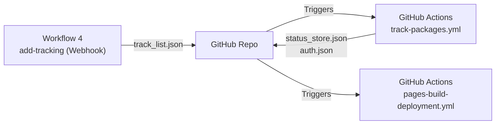

# ARCHITECTURE.md — NTWKKM Personal Website

## Overview

Static personal website hosted on GitHub Pages (`ntwkkm.github.io`). Serves as a professional portfolio for an Emergency Medicine physician & Clinical Informatics developer.

## Pages

| File                   | Purpose                                                    |
| ---------------------- | ---------------------------------------------------------- |
| `index.html`           | Homepage — paper slider + project portfolio grid           |
| `blog.html`            | Research blog reader — sidebar list + article detail view  |
| `tracking/index.html`  | Package tracking dashboard — Thailand Post status viewer   |
| `fray/index.html`      | Fray Memory Dashboard — Project Fractal observability      |

## New Files (PWA & Accessibility)

| File                   | Purpose                                                    |
| ---------------------- | ---------------------------------------------------------- |
| `manifest.json`        | PWA manifest — enables installable web app experience      |
| `sw.js`                | Service Worker — offline support with intelligent caching  |

## Data Flow

```text
n8n Automated (via GitHub API):
  ├── papers.json            → Pushed by Workflow 2 (pubmed-ai-web-notion)
  │                            AI-curated top 12 EM papers, merged with existing, cap 70
  │                            Triggers: pages-build-deployment.yml (deploy only)
  └── latest_updates.json    → Pushed by Workflow 3 (notion-github-blog)
                               Latest 20 AI-summarized entries from Notion Ai-research DB
                               Triggers: process-blog-data.yml → auto-deleted after processing

GitHub Actions (process-blog-data.yml):
  ├── Merges latest_updates.json with existing chunked data
  ├── Deduplicates by Notion page ID (Map-based merge)
  ├── Splits into ≤200 posts per file → data/blog/research_chunk_*.json
  ├── Updates blog_index.json with relative paths
  └── Deletes latest_updates.json after successful processing

Static Data:
  ├── papers.json            → Paper slider data (index.html, automated by Workflow 2)
  ├── blog_index.json        → File list for blog.html (auto-generated by GitHub Actions)
  ├── data/blog/*.json       → Chunked blog entries (auto-generated by GitHub Actions)
  └── projects.json          → Project cards (manually maintained)

Package Tracking Pipeline:
  n8n Workflow 4 (add-tracking, on-demand via webhook):
    └── Dashboard form POST → n8n webhook → GET/PUT track_list.json via GitHub API

  GitHub Actions (track-packages.yml, 4x/day + on push to track_list.json):
    ├── Reads tracking/track_list.json
    ├── Calls Thailand Post Track & Trace API (2-step token auth)
    ├── Diffs new status against tracking/status_store.json
    ├── Commits only when status changes ([skip ci])
    └── Dashboard: tracking/index.html fetches status_store.json client-side
```

### Pipeline Chains

```text
Path A — papers.json (Workflow 2, daily 02:01 & 05:01):
  n8n commits papers.json via GitHub API
    → Triggers: pages-build-deployment.yml (deploy to GitHub Pages)
    → update-readme.yml ignores (paths-ignore)

Path B — latest_updates.json (Workflow 3, daily 02:25):
  n8n commits latest_updates.json via GitHub API
    → Triggers: process-blog-data.yml (merge + chunk + index + delete)
    → Triggers: pages-build-deployment.yml (deploy to GitHub Pages)
    → update-readme.yml ignores latest_updates.json (paths-ignore)

Path C — tracking/track_list.json (Workflow 4, on-demand):
  Dashboard form → n8n webhook → commits track_list.json via GitHub API
    → Triggers: track-packages.yml (poll Thailand Post API & generate auth.json)
    → Commits tracking/status_store.json and auth.json
    → Triggers: pages-build-deployment.yml
```

### Key Rules

- `latest_updates.json` — **Ephemeral.** Pushed by n8n (Workflow 3), deleted by both `process_blog.js` (in-script) and the GitHub Actions `rm -f` safety step (`if: always()`). Must never be committed long-term.
- `data/blog/research_chunk_*.json` — **Auto-generated.** Created by `process_blog.js`. Each file contains ≤200 posts. Never edit manually.
- `blog_index.json` — **Auto-generated.** Written by `process_blog.js` with relative paths (e.g., `data/blog/research_chunk_1.json`). Never edit manually.
- `papers.json` — **Automated.** Merged by Workflow 2 (dedup by link, cap 70 items, 2x/day). Do not edit manually.
- `projects.json` — **Manual.** Edit directly to add/remove project cards.
- `tracking/track_list.json` — **Semi-automated.** Add barcodes via dashboard webhook form (n8n Workflow 4) or edit directly. Remove manually.
- `tracking/status_store.json` — **Auto-generated.** Updated by `tracker.py` via GitHub Actions. Never edit manually.
- `tracking/auth.json` — **Auto-generated.** SHA-256 hash of the `TRACKING_PASSCODE` GitHub Secret. Used for client-side authentication on the tracking dashboard.

> **Deduplication:** The processing script uses a `Map<id, post>` strategy — existing posts are loaded first, then updates are applied on top. If an ID exists in both old data and new updates, the update wins. This eliminates the legacy bug where editing old Notion entries caused duplicates across split files.

## n8n Automation Layer (Upstream)

Three n8n workflows operate as **micro-automations** that feed data into this repository and Notion. They run on a self-hosted n8n instance and form the upstream pipeline for all research content.

### Notion Database Topology

The system uses **3 distinct Notion databases** that form a processing chain:

| Database | Notion Name | Role |
| --- | --- | --- |
| Source DB | `research n8n` | Raw paper intake — WF2 writes curated papers here, WF1 reads from here |
| Output DB | `Ai-research` | AI-processed papers with Thai summaries — WF1 writes, WF3 reads |
| Index Log | `index reserch` | PMID deduplication log — WF1 reads/writes to prevent reprocessing |

```text
Data chain: WF2 → research n8n → WF1 → Ai-research → WF3 → GitHub
```

### Workflow 1: `research-ai-notion` — Data Pipeline

**Purpose:** Fetch raw research papers, summarize with AI in Thai, generate tags, and store in Notion.

| Property | Value |
| --- | --- |
| Schedule | Daily at 02:15 and 05:15 |
| AI Model | Gemini 3.1 Flash Lite |
| Output | Notion Database (`Ai-research`) |
| Batch Size | 3 papers per run (resource-constrained) |

**Pipeline:**

```text
research n8n DB (source) → Wait(20s) → Aggregate
  → Get index reserch DB (log) → Filter Duplicates by PMID (JS, limit 3/run)
  → Loop per paper:
      PubMed E-Fetch API (abstract XML) → Parse XML to plain text (JS)
      → Gemini 3.1 Flash Lite (summarize Thai + 3 EN tags) → Clean JSON
      → n8n Data Table backup → Write to Ai-research DB (output)
      → Wait(15s) → Update index reserch DB (log) → Wait(15s) → Next
  → LINE notification on loop completion
```

**AI Output per Paper:**

1. Extracted title
2. Thai summary (Objective, Methods, Results & Statistical Analysis)
3. Three English keyword tags

**Deduplication:** JS code compares incoming PMIDs against the `index reserch` Notion DB. Only unprocessed PMIDs proceed.

**Rate Limiting:** Wait nodes (15–20s) are inserted between Notion/PubMed API calls to avoid throttling.

**Internal Backup:** Each processed paper is also written to an n8n Data Table (`Notion-AI-Research`) before Notion, serving as an audit log.

---

### Workflow 2: `pubmed-ai-web-notion` — Expert Curation

**Purpose:** Search PubMed for latest EM research, AI-curate top 12 clinically significant papers, publish to website and Notion.

| Property | Value |
| --- | --- |
| Schedule | Daily at 02:01 and 05:01 |
| AI Model | Gemini 2.5 Pro (AI Agent) |
| Search Scope | PubMed E-Search `retmax=300` with `usehistory=y` |
| Output | `papers.json` (GitHub) + `research n8n` DB (Notion) |
| Trigger | Schedule (keyword: `emergency`, 7-day window) **or** LINE chat via sub-workflow |

**Pipeline:**

```text
Trigger A (Schedule): PubMed E-Search (term="emergency", retmax=300)
Trigger B (LINE chat): AI Router (Gemini) extracts medical term → E-Search
  → Parse XML (QueryKey + WebEnv) → Wait(20s) → E-Fetch (titles + PMIDs)
  → Parse XML → Aggregate into summary text
  → Gemini 2.5 Pro AI Agent (role: Senior EM Consultant)
      ├── Select Top 12 Clinical Significance from ~300 candidates
      ├── Criteria: practice-changing, controversial, innovative
      └── 1-sentence Thai summary per paper + PubMed link
  → LINE push to user
  → Parse AI text to JSON (Title, Comment, Link)
  → GitHub: Get existing papers.json → Merge (dedup by Link, cap 70) → Edit file
  → Wait(20s) → Notion: Query research n8n DB → Aggregate titles
  → Wait(20s) → Filter duplicate titles → Loop: Create pages (10s Wait)
  → LINE notification on completion
```

**Key Detail:** This workflow **merges** new papers with existing `papers.json` (dedup by link URL, cap 70 items). The file is edited directly on `NTWKKM/ntwkkm.github.io` via GitHub API. The LINE chat trigger invokes this workflow as a **sub-workflow** via `executeWorkflowTrigger`.

---

### Workflow 3: `notion-github-blog` — Content Syndication

**Purpose:** Pull AI-summarized research from Notion and sync to GitHub as the blog data feed.

| Property | Value |
| --- | --- |
| Schedule | Daily at 02:25 |
| Input | Notion Database (`Ai-research`) — latest 20 entries |
| Output | `latest_updates.json` (GitHub, ephemeral) |

**Pipeline:**

```text
Notion Ai-research DB (sorted by last_edited, limit 20)
  → Aggregate → Generate full PubMed URLs (https://pubmed.ncbi.nlm.nih.gov/[PMID]/)
  → Format as JSON → Push as latest_updates.json to GitHub
  → Triggers process-blog-data.yml (merge + chunk + index)
  → LINE notification
```

---

### Workflow 4: `add-tracking` — Package Tracking Input

**Purpose:** Accept new tracking barcodes from the dashboard form and commit to `track_list.json` via GitHub API. Designed to handle Fly.io scale-to-zero cold starts gracefully.

| Property | Value |
| --- | --- |
| Trigger | Webhook POST from `tracking/index.html` |
| Endpoint | `https://ntwkkm-n8n-final.fly.dev/webhook/add-tracking` |
| Output | `tracking/track_list.json` (GitHub commit) |
| CORS | Handled natively by n8n Webhook Node (Restricted to `https://ntwkkm.github.io`) |

**Pipeline:**

```text
Frontend: GET /healthz (No-CORS) to pre-warm Fly.io server on form open
  ↓
Webhook POST (barcode, note)
  → Validate Input (Empty Check) ──[Empty]──→ Respond 400
  → GET tracking/track_list.json via GitHub API
  → Code: Decode Base64 → Validate Regex → Dedup Check → Append
  → Routing (If Nodes):
      ├── [Error/Invalid Format] → Respond 400
      ├── [Duplicate Barcode] ───→ Respond 409 Conflict
      └── [Valid & New] ─────────→ PUT track_list.json (Commit)
                                     ↳ Respond 200 Success
  → Commit triggers: track-packages.yml (poll Thailand Post API)
```

**Cold Start Mitigation:** The n8n instance runs on a Fly.io free tier which sleeps when inactive. The frontend implements a "Pre-warm" strategy by firing a background `GET /healthz` request as soon as the user opens the Add Tracking form, ensuring the instance is awake by the time the user hits submit. The UI also provides a `⏳ Waking server...` fallback message if the webhook takes > 2.5s.

**Validation & Deduplication:** The Code node strictly checks the `XX000000000XX` format and prevents duplicate entries. Duplicates route to a dedicated response node returning `409 Conflict`, which the frontend catches to display a specific "already being tracked" warning.

---

### Workflow Orchestration

```text
Schedule Overview (Daily):

  02:01  Workflow 2 — PubMed search + AI curation → papers.json (GitHub)
  02:15  Workflow 1 — Raw paper pipeline → Notion Ai-research DB
  02:25  Workflow 3 — Notion → latest_updates.json (GitHub)
                        └── Triggers: process-blog-data.yml → chunked blog data
                        └── Triggers: pages-build-deployment.yml → deploy

  04:00 - 07:30  (Every 30 mins) track-packages.yml (Thailand Post API)
  08:00, 12:00, 18:00, 22:00     track-packages.yml (Thailand Post API)

  05:01  Workflow 2 — Second run (same as above)
  05:15  Workflow 1 — Second run (same as above)
```

**Data Flow 1: Medical Research Pipeline**


**Data Flow 2: Package Tracking System**



### External Services

| Service | Role |
| --- | --- |
| **PubMed API** | E-Search + E-Fetch for research paper discovery and abstract retrieval |
| **Gemini 3.1 Flash Lite** | Fast, cost-efficient summarization (Workflow 1) |
| **Gemini 2.5 Pro** | High-quality clinical curation with expert persona (Workflow 2) |
| **Notion** | Primary data warehouse — stores all processed papers, index logs, and curated selections |
| **LINE Messaging API** | Notification channel + chat-based trigger for on-demand searches |
| **GitHub API** | Direct file commits (`papers.json`, `latest_updates.json`, `track_list.json`) |
| **Thailand Post API** | Track & Trace barcode status polling (2-step token auth, Workflow 4 + GitHub Actions) |

## CI/CD Workflows

| Workflow | Trigger | Concurrency Group | Purpose |
| --- | --- | --- | --- |
| `process-blog-data.yml` | Push to `latest_updates.json` or manual | `blog-data-processing` | Merge, deduplicate, chunk blog data |
| `pages-build-deployment.yml` | Push to `main` or manual | `pages` | Build and deploy to GitHub Pages |
| `update-readme.yml` | Push to `main` (ignores `README.md`, `latest_updates.json`) | `readme-update` | Auto-generate repository tree in README |
| `track-packages.yml` | Schedule (4x/day), push to `track_list.json`, or manual | `package-tracking` | Poll Thailand Post API, update tracking status |

> **Concurrency:** All workflows use `cancel-in-progress: false` to ensure sequential execution. This prevents deployment conflicts when multiple n8n commits arrive in quick succession.

### CI Scripts

| Script | Purpose |
| --- | --- |
| `.github/scripts/process_blog.js` | Merge `latest_updates.json` with existing chunks, deduplicate by ID, split into ≤200-post files, update `blog_index.json` |
| `.github/scripts/generate_readme.js` | Generate repository file tree for README.md (collapses `data/blog/` to summary) |
| `.github/scripts/tracker.py` | Authenticate with Thailand Post API, fetch tracking events, diff against `status_store.json`, update on changes |

## Theming

All pages use `data-theme="light|dark"` on the `<html>` element with `localStorage.theme` persistence. Theme selection syncs seamlessly across the site.

### CSS Architecture

- `shared.css` — Common styles (reset, theme toggle, skip-to-content, reduced-motion)
- `index.html <style>` — Homepage-specific styles (paper slider, portfolio grid, header)
- `blog.html <style>` — Blog-specific styles (sidebar, article view, search, filters)
- `tracking/index.html <style>` — Tracking dashboard styles (passcode gate, status timeline, package grid)

## Security

All JSON data is sanitized before DOM injection via:

- `escapeHTML(str)` — escapes `<`, `>`, `&`, `"` entities
- `sanitizeURL(url)` — validates `http:` / `https:` protocol only

## Tag Filtering (blog.html)

- **Normalization:** AI-generated tags are normalized client-side via `TAG_NORMALIZATION` map (e.g., `Emergency` → `Emergency Medicine`, `Artificial Intelligence` → `AI`). No pipeline changes needed.
- **Top-N Pills:** Only the top 12 tags (by post count) are shown as filter pills with count badges. Remaining tags are accessible via a "More ▾" dropdown.
- **Multi-select:** Tags use OR logic — selecting multiple tags shows posts matching **any** active tag. "All" clears selection.
- **URL State:** Active tags are persisted in `?tag=` query param (comma-separated). Shareable via URL, restored on page load and browser back/forward.

## Caching

- JSON fetches include `?v=${Date.now()}` cache-buster to ensure freshness after n8n updates
- `blog.html` has a 5-minute `localStorage` cache (`research_blog_data`)
- **Service Worker** (`sw.js`) implements dual caching strategy:
  - **Static assets**: Cache-first with background refresh
  - **Dynamic content**: Network-first with cache fallback
  - Offline support for core pages and previously viewed content

## Enhanced Features (Recent Updates)

### Error Handling & Resilience

- `fetchWithFallback()` — Exponential backoff retry mechanism (max 2 retries)
- `createErrorUI()` — Reusable error state with retry button
- `createSkeletonUI()` — Loading skeleton generator for better UX
- Graceful degradation when APIs fail or network is unavailable

### Accessibility (WCAG 2.1)

- `announceToScreenReader()` — Dynamic announcements for screen readers
- `initScreenReaderAnnouncer()` — Screen reader support element
- Enhanced focus management with `:focus-visible` styles
- Skip-to-content links on all pages
- ARIA labels for interactive elements
- Keyboard navigation support throughout

### Citation Export (blog.html)

- **Formats supported**: APA, MLA, Vancouver, BibTeX
- `generateCitation(post, format)` — Generates properly formatted citations
- Modal interface with format tabs and copy-to-clipboard functionality
- Automatic PMID inclusion when available

### Reading Progress Indicator

- Fixed progress bar at top of page during article reading
- Real-time scroll position tracking
- Gradient styling matching site theme

### Search Optimization

- `fuzzyMatch(query, text)` — Fuzzy search algorithm for better matching
- `highlightText(text, query)` — Highlights matched terms in results
- Search highlights with yellow background for visibility

### PWA Support

- **Installable**: Users can add to home screen on mobile/desktop
- **Offline-first**: Core pages cached for offline access
- **Background sync**: Ready for future offline data synchronization
- **Theme color**: Matches site branding (#244885)
- **Icons**: SVG-based icons in multiple sizes (32, 192, 512)
